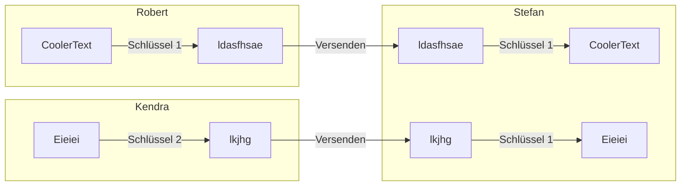
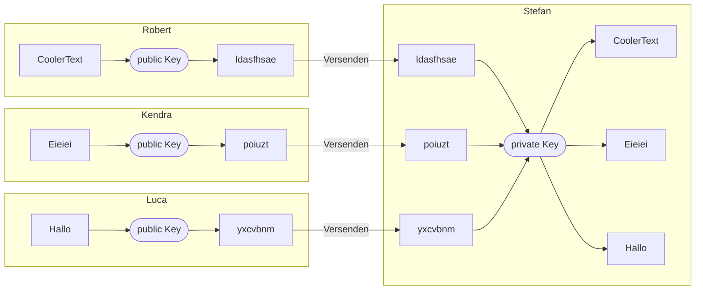
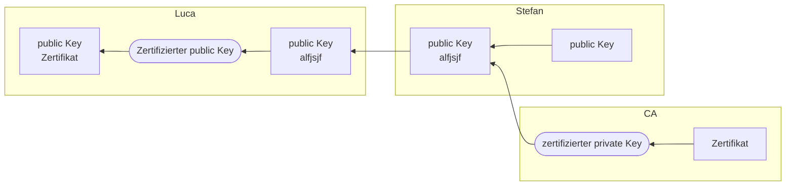

# Verschlüsselung

## Symmetrisch vs Asymmetrisch Kommunikation

### Symmetrisch

Bei symmetrischer Verschlüsslung haben beide Seiten den selben Schlüssel. Mit dem Schlüssel wird ver- und entschlüsselt.

#### Pro
- schnell

#### Con
- Beide müssen den selben schlüssel haben.

### Asymmetrisch

Bei der Asymmetrischen Kommunikation gibt es 2 verschiedene schlüssel fürs ent- und verschlüsseln.

Der public key ist zum verschlüsseln da und kann von jedem eingesehen werden. 

Der private key ist zum entschlüsseln und muss von enpfänger geheim gehalten werden.

Hier kann nur Stefan die Nachichten Lesen. Gäbe es oben weitere Sender müsste man für jeden einen eigenen Schlüssel haben oder alle könnten die Nachichten lesen.

#### Pro
- wenige schlüssel
- jeder kann mit dem public key an den Enpfanger senden.

#### Con
- seeehr langsam

#### Rückwertsverschlüsslung

Man kann auch mit dem private key verschlüsseln und mit dem public Key entschlüsseln.

## TLS

TLS (Transport Layer Security) ist die standart Verschlüsslung im Internet und wird z.B. bei HTTPS genutzt.

TLS nutzt symmetrische Kommunikation für Daten, aber asymmetrische Kommunikation um den symmetrischen Schlüssel auszutauschen.

1. Step asymmetrisch: Nutzer schickt für die Session einen Key.

2. Step symmetrisch: Dieser Key wird genutzt

### Signatur

Bei step 1 muss der User sicher sein, dass der public Key auch der richtige ist. Sonst könnte ein Bösewicht einfach seinen public key senden und die nachichten lesen.

Dazu signiert der Server seinen public key mit einem Zertifikat. Dieses Zertifikat erhält er von einer zertifizierten Stelle welche es mit einem privaten key verschlüsselt hat.  
Der User kann mit dem zertifizierten public key (welcher schon im Browser ist) den Verschlüsselten Teil entschlüsseln und so sicher sein, dass der Schlüssel echt ist.  
Würde ein Bösewicht einen falschen public Key senden, so könnte er das Zertifikat nicht Verschlüsseln, da er den zertifizierten private Key nicht hat.

